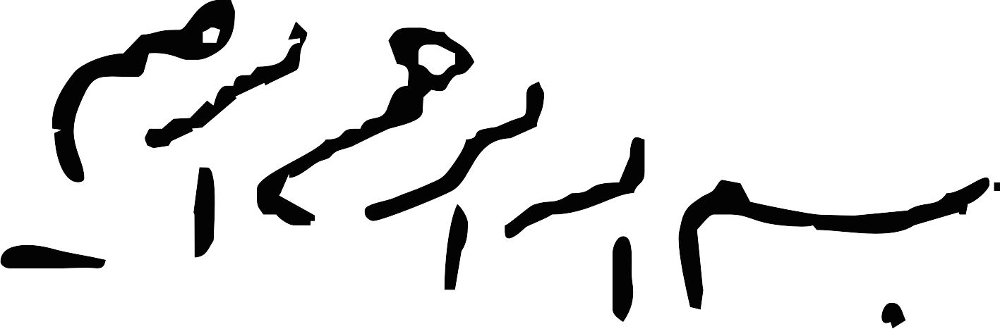

<!-- saved from url=(0036)http://www.cs.columbia.edu/~rasooli/ -->
<html><head><meta http-equiv="Content-Type" content="text/html; charset=UTF-8">

</head><body><ul>

  

   

<title>Mohammad Sadegh Rasooli</title>

<!--[endif]--><b style="mso-bidi-font-weight:
normal"></b>

<b>Mohammad Sadegh Rasooli</b>

<b>Research Scientist, <a href="https://research.fb.com"><b>Facebook AI</b></a>

PhD of Computer Science, <a  href="http://www.cs.columbia.edu/">Columbia University</a>

lastname-at-fb.[com]

<a href="http://www.cs.columbia.edu/~rasooli/res10.pdf" style="color:red">CV</a> (Updated: 1 September 2017)

<table>
  <tbody><tr>
    <td> </td>
<td></td>
    <td></td>
<td></td>
    <td></td>
  </tr>
</tbody></table>
 
<!-- 

<b style="color:blue"> <h1><b>Education</b></h1></b>
<ul><ul>

  <li>
<b>PhD, Computer Science.</b> 
Columbia University, New York 
<em>2012-?.</em>
</li>

  <li>
<b>MSc., Computer Science.</b> 
Columbia University, New York 
<em>2012-2014.</em>
</li>

  <li>
<b>MSc., Artificial Intelligence.</b> 
Iran University of Science and Technology, Tehran 
<em>2009-2012.</em>
</li>

  <li>
<b>BSc, Software Engineering.</b> 
Iran University of Science and Technology, Tehran 
<em>2005-2009.</em>
</li>

</ul></ul>
 -->

<b style="color:blue"> <h1><b>Publications</b></h1></b>
<!-- 

<ul> -->
<!-- <h3><b>2015</b></h3> -->
<ul>
    <ul>
      <li>
<b><a href="https://arxiv.org/abs/1803.04291">Entity-Aware Language Model as an Unsupervised Reranker</a></b> 
<b>Mohammad Sadegh Rasooli</b>, and Sarangarajan Parthasarathy.  <em> INTERSPEECH 2018.</em> <small><a href="javascript:ReplaceDivs(&quot;interspeech18_abstract&quot;, &quot;interspeech18&quot;,&quot;interspeech18_b&quot;);">[abstract]</a></small> <small><a href="javascript:ReplaceDivs(&quot;interspeech18_text&quot;, &quot;interspeech18_b&quot;,&quot;interspeech18&quot;);">[bibtex]</a></small>

<blockquote>
<pre>

@article{DBLP:journals/corr/abs-1803-04291,
  author    = {Mohammad Sadegh Rasooli and
               Sarangarajan Parthasarathy},
  title     = {Entity-Aware Language Model as an Unsupervised Reranker},
  journal   = {CoRR},
  volume    = {abs/1803.04291},
  year      = {2018},
  url       = {http://arxiv.org/abs/1803.04291},
  archivePrefix = {arXiv},
  eprint    = {1803.04291},
  timestamp = {Tue, 10 Apr 2018 20:50:05 +0200},
  biburl    = {https://dblp.org/rec/bib/journals/corr/abs-1803-04291},
  bibsource = {dblp computer science bibliography, https://dblp.org}
}

</pre>
</blockquote>

<blockquote>

In language modeling, it is difficult to incorporate entity relationships from a knowledge-base. One solution is to use a reranker trained with global features, in which global features are derived from n-best lists. However, training such a reranker requires manually annotated n-best lists, which is expensive to obtain. We propose a method based on the contrastive estimation method that alleviates the need for such data. Experiments in the music domain demonstrate that global features, as well as features extracted from an external knowledge-base, can be incorporated into our reranker. Our final model achieves a 0.44 absolute word error rate improvement on the blind test data.
 

</blockquote>

</li><li>
<b><a href="https://link.springer.com/article/10.1007/s10590-017-9202-6">Cross-Lingual Sentiment Transfer with Limited Resources</a></b> 
<b>Mohammad Sadegh Rasooli</b>, Noura Farra, Axinia Radeva, Tao Yu and Kathleen McKeown.  <em>Machine Translation, Volume 32, Issue 1–2, pp 143–165, 2018.</em> <small><a href="javascript:ReplaceDivs(&quot;mtj17_abstract&quot;, &quot;mtj17&quot;,&quot;mtj17_b&quot;);">[abstract]</a></small> <small><a href="javascript:ReplaceDivs(&quot;bib_mtj17_text&quot;, &quot;mtj17_b&quot;,&quot;mtj17&quot;);">[bibtex]</a></small> <small><a href="https://github.com/rasoolims/senti-lstm">[code]</a></small>

<a href="https://github.com/rasoolims/senti-lstm">

<blockquote>
  <pre>

@Article{Rasooli2018,
author="Rasooli, Mohammad Sadegh
and Farra, Noura
and Radeva, Axinia
and Yu, Tao
and McKeown, Kathleen",
title="Cross-lingual sentiment transfer with limited resources",
journal="Machine Translation",
year="2018",
month="Jun",
day="01",
volume="32",
number="1",
pages="143--165",
issn="1573-0573",
doi="10.1007/s10590-017-9202-6",
url="https://doi.org/10.1007/s10590-017-9202-6"
}
</pre>
</blockquote>

<blockquote>

We describe two transfer approaches for building sentiment analysis systems without having gold labeled data in the target language. Unlike previous work that is focused on using only English as the source language and a small number of target languages, we use multiple source languages to learn a more robust sentiment transfer model for 16 languages from different language families. Our approaches explore the potential of using an annotation projection approach and a direct transfer approach using cross-lingual word representations and neural networks. Whereas most previous work relies on machine translation, we show that we can build cross-lingual sentiment analysis systems without machine translation or even high quality parallel data. %We have conducted experiments with and without parallel data (e.g. using comparable corpora). We have conducted experiments assessing the availability of different resources such as in-domain parallel data, out-of-domain parallel data, and in-domain comparable data. Our experiments show that we can build a robust transfer system whose performance can in some cases approach that of a supervised system.  

</blockquote>

</a></li><li>
<a href="https://github.com/rasoolims/senti-lstm"><b></b></a>

      <li>
<b><a href="http://aclweb.org/anthology/I17-2003">Transferring Semantic Roles Using Translation and Syntactic Information</a></b> 
Maryam Aminian, <b>Mohammad Sadegh Rasooli</b>, and Mona Diab.  <em> IJCNLP 2017.</em> <small><a href="javascript:ReplaceDivs(&quot;ijcnlp17_abstract&quot;, &quot;ijcnlp17&quot;,&quot;ijcnlp17_b&quot;);">[abstract]</a></small> <small><a href="javascript:ReplaceDivs(&quot;bib_ijcnlp17_text&quot;, &quot;ijcnlp17_b&quot;,&quot;ijcnlp17&quot;);">[bibtex]</a></small>

<blockquote>
<pre>

@InProceedings{I17-2003,
  author =  "Aminian, Maryam
    and Rasooli, Mohammad Sadegh
    and Diab, Mona",
  title =   "Transferring Semantic Roles Using Translation and Syntactic Information",
  booktitle =   "Proceedings of the Eighth International Joint Conference on Natural Language Processing (Volume 2: Short Papers)",
  year =  "2017",
  publisher =   "Asian Federation of Natural Language Processing",
  pages =   "13--19",
  location =  "Taipei, Taiwan",
  url =   "http://aclweb.org/anthology/I17-2003"
}

</pre>
</blockquote>

<blockquote>

Annotation projection for semantic role labeling is a transfer method that aims to develop systems for resource-poor languages using supervised annotations of a resource-rich language through parallel data. We propose a method that employs information from source and target syntactic dependencies as well as word alignment density to improve the quality of an iterative bootstrapping method.  Our experiments yield a $3.5$ absolute labeled F-score improvement over a standard annotation projection method. 

</blockquote>

  <li> <b><a href="https://transacl.org/ojs/index.php/tacl/article/view/922/244">Cross-Lingual Syntactic Transfer with Limited Resources</a></b> 
<b>Mohammad Sadegh Rasooli</b> and Michael Collins.  
<em>Transactions of the ACL, 5:279--293, 2017.</em><small><a href="javascript:ReplaceDivs(&quot;tacl17_abstract&quot;, &quot;tacl17&quot;,&quot;tacl17_b&quot;);">[abstract]</a></small> <small><a href="javascript:ReplaceDivs(&quot;bib_tacl17_text&quot;, &quot;tacl17_b&quot;,&quot;tacl17&quot;);">[bibtex]</a></small> <small><a href="https://github.com/rasoolims/YaraParser/tree/transfer">[code]</a></small>
</li><a href="https://github.com/rasoolims/YaraParser/tree/transfer">

<blockquote>

We describe a simple but effective method for cross-lingual syntactic transfer of dependency parsers, in the scenario where a large amount of translation data is not available. The method makes use of three steps: 1) a method for deriving cross-lingual word clusters, which can then be used in a multilingual parser; 2) a method for transferring lexical information from a target language to source language treebanks; 3) a method for integrating these steps with the density-driven annotation projection method of Rasooli and Collins (2015). Experiments show improvements over the state-of-the-art in several languages used in previous work, in a setting where the only source of translation data is the Bible, a considerably smaller corpus than the Europarl corpus used in previous work. Results using the Europarl corpus as a source of translation data show additional improvements over the results of Rasooli and Collins (2015). We conclude with results on 38 datasets from the Universal Dependencies corpora.

</blockquote>

<blockquote>
<pre>

@article{rasooli_16,
author = {Rasooli, Mohammad Sadegh and Collins, Michael },
title = {Cross-Lingual Syntactic Transfer with Limited Resources},
journal = {Transactions of the Association for Computational
Linguistics},
volume = {5},
year = {2017},
keywords = {},
issn = {2307-387X},
url = {https://transacl.org/ojs/index.php/tacl/article/view/922},
 pages = {279--293}
}

</pre>
</blockquote>

</a><li>
<a href="https://github.com/rasoolims/YaraParser/tree/transfer"><b></b></a><b><a href="http://www.aclweb.org/anthology/D15-1039">Density-Driven Cross-Lingual Transfer of Dependency Parsers</a></b> 
<b>Mohammad Sadegh Rasooli</b> and Michael Collins. 
<em>EMNLP 2015.</em><small><a href="javascript:ReplaceDivs(&quot;emnlp15_abstract&quot;, &quot;emnlp15&quot;,&quot;emnlp15_b&quot;);">[abstract]</a></small> <small><a href="javascript:ReplaceDivs(&quot;bib_emnlp15_text&quot;, &quot;emnlp15_b&quot;,&quot;emnlp15&quot;);">[bibtex]</a></small> <small><a href="http://www.cs.columbia.edu/~rasooli/papers/emnlp_presentation_15.pdf">[Slides]</a></small> <small><a href="https://vimeo.com/156486643">[Video]</a></small> <small><a href="https://www.dropbox.com/s/5lltxucr7cju1ru/emnlp15_final_models.zip?dl=0">[Models &amp; Runnable jar]</a></small>  
</li>

<blockquote>

We present a novel method for the crosslingual transfer of dependency parsers. Our goal is to induce a dependency parser in a target language of interest without any direct supervision: instead we assume access to parallel translations between the target and one or more source languages, and to supervised parsers in the source language(s). Our key contributions are to show the utility of dense projected structures when training the target language parser, and to introduce a novel learning algorithm that makes use of dense structures. Results on several languages show an absolute improvement of 5.51% in average dependency accuracy over the state-of-the-art method of (Ma and Xia, 2014). Our average dependency accuracy of 82.18% compares favourably to the accuracy of fully supervised methods.

</blockquote>

<blockquote>
<pre>

@InProceedings{rasooli-collins:2015:EMNLP,
  author    = {Rasooli, Mohammad Sadegh  and  Collins, Michael},
  title     = {Density-Driven Cross-Lingual Transfer of Dependency Parsers},
  booktitle = {Proceedings of the 2015 Conference on Empirical Methods in Natural Language Processing},
  month     = {September},
  year      = {2015},
  address   = {Lisbon, Portugal},
  publisher = {Association for Computational Linguistics},
  pages     = {328--338},
  url       = {http://aclweb.org/anthology/D15-1039}
}

</pre>
</blockquote>

<li>
<b><a href="http://www.cs.columbia.edu/~rasooli/papers/On_the_Importance_of_Ezafe_Construction_in_Persian_Parsing.pdf">On the Importance of Ezafe Construction in Persian Parsing</a></b> 
Alireza Nourian, <b>Mohammad Sadegh Rasooli</b>, Mohsen Imany and Heshaam Faili. 
<em>ACL-IJCNLP 2015.</em><small><a href="javascript:ReplaceDivs(&quot;acl15_abstract&quot;, &quot;acl15&quot;,&quot;acl15_b&quot;);">[abstract]</a></small> <small><a href="javascript:ReplaceDivs(&quot;bib_acl15_text&quot;, &quot;acl15_b&quot;,&quot;acl15&quot;);">[bibtex]</a></small> <small><a href="http://www.cs.columbia.edu/~rasooli/papers/acl15_poster.pdf">[Poster]</a></small>
</li>

<blockquote>

 Ezafe construction is an idiosyncratic phenomenon in the Persian language. It is a good indicator for phrase boundaries and dependency relations but mostly does not appear in the text. In this paper, we show that adding information about Ezafe construction can give 4.6% relative improvement in dependency parsing and 9% relative improvement in shallow parsing. For evaluation purposes, Ezafe tags are manually annotated in the Persian dependency treebank. Furthermore, to be able to conduct experiments on shallow parsing, we develop a dependency to shallow phrase structure convertor based on the Persian dependencies.

</blockquote>

<blockquote>
<pre>

@InProceedings{nourian-EtAl:2015:ACL-IJCNLP,
  author    = {Nourian, Alireza  and  Rasooli, Mohammad Sadegh  and  Imany, Mohsen  and  Faili, Heshaam},
  title     = {On the Importance of Ezafe Construction in Persian Parsing},
  booktitle = {Proceedings of the 53rd Annual Meeting of the Association for Computational Linguistics and the 7th International Joint Conference on Natural Language Processing (Volume 2: Short Papers)},
  month     = {July},
  year      = {2015},
  address   = {Beijing, China},
  publisher = {Association for Computational Linguistics},
  pages     = {877--882},
  url       = {http://www.aclweb.org/anthology/P15-2144}
}

</pre>
</blockquote>

<li>
<a href="http://arxiv.org/pdf/1503.06733v1.pdf"><b>Yara Parser: A Fast and Accurate Dependency Parser</b></a> 
<b>Mohammad Sadegh Rasooli</b> and Joel Tetreault. 
<em>arXiv:1503.06733v2 [cs.CL], 2015.</em><small><a href="javascript:ReplaceDivs(&quot;arxiv15_abstract&quot;, &quot;arxiv15&quot;,&quot;arxiv15_b&quot;);">[abstract]</a></small> <small><a href="javascript:ReplaceDivs(&quot;bib_arxiv15_text&quot;, &quot;arxiv15_b&quot;,&quot;arxiv15&quot;);">[bibtex]</a></small> <small><a href="https://github.com/yahoo/YaraParser">[Code]</a></small>
</li>

<blockquote>

 Dependency parsers are among the most crucial tools in natural language processing as they have many important applications in downstream tasks such as information retrieval, machine translation and knowledge acquisition. We introduce the Yara Parser, a fast and accurate open-source dependency parser based on the arc-eager algorithm and beam search. It achieves an unlabeled accuracy of 93.32 on the standard WSJ test set which ranks it among the top dependency parsers. At its fastest, Yara can parse about 4000 sentences per second when in greedy mode (1 beam). When optimizing for accuracy (using 64 beams and Brown cluster features), Yara can parse 45 sentences per second. The parser can be trained on any syntactic dependency treebank and different options are provided in order to make it more flexible and tunable for specific tasks. It is released with the Apache version 2.0 license and can be used for both commercial and academic purposes. The parser can be found at <a href="https://github.com/yahoo/YaraParser">https://github.com/yahoo/YaraParser</a>.

</blockquote>

<blockquote>
<pre>

@article{DBLP:journals/corr/RasooliT15,
  author    = {Mohammad Sadegh Rasooli and Joel R. Tetreault},
  title     = {Yara Parser: {A} Fast and Accurate Dependency Parser},
  journal   = {CoRR},
  volume    = {abs/1503.06733},
  year      = {2015},
  url       = {http://arxiv.org/abs/1503.06733},
  timestamp = {Thu, 09 Apr 2015 11:33:20 +0200},
  biburl    = {http://dblp.uni-trier.de/rec/bib/journals/corr/RasooliT15},
  bibsource = {dblp computer science bibliography, http://dblp.org}
}

</pre>
</blockquote>

<!-- <h3><b>2014</b></h3> -->

<li>
<b><a href="http://www.scict.ir/portal/Home/ShowPage.aspx?Object=Publishing&amp;CategoryID=0e14e7d7-7631-4afe-b5d5-314acb3d3e4e&amp;WebPartID=8bf33094-f39f-46f6-98a5-1d5b6220e68d&amp;ID=6c3044fc-2c30-4c44-ab85-a7c8a270ecd0">Persian Syntactic Treebank: a Research Based on Dependency Grammar</a></b> 
<b>Mohammad Sadegh Rasooli</b>, Manouchehr Kouhestani and Amirsaeid Moloodi. 
<em>‌SCICT; in Persian; ISBN = 313-388-3388-81-3.</em>
</li>

<li>
<b><a href="http://193.6.4.39/~czap/letoltes/IS14/IS2014/PDF/AUTHOR/IS141114.PDF">Improving Deep Neural Network Acoustic Modeling For Audio Corpus Indexing Under The IARPA Babel Program</a></b> 
Xiaodong Cui, Brian Kingsbury, Jia Cui, Bhuvana Ramabhadran andrew Rosenberg, <b>Mohammad Sadegh Rasooli</b>, Owen Rambow, Nizar Habash and Vaibhava Goel. 
<em>INTERSPEECH 2014.</em><small><a href="javascript:ReplaceDivs(&quot;interspeech15_abstract&quot;, &quot;interspeech15&quot;,&quot;interspeech15_b&quot;);">[abstract]</a></small> <small><a href="javascript:ReplaceDivs(&quot;bib_interspeech15_text&quot;, &quot;interspeech15_b&quot;,&quot;interspeech15&quot;);">[bibtex]</a></small>
</li>

<blockquote>

 This paper is focused on several techniques that improve deep neural network (DNN) acoustic modeling for audio corpus indexing in the context of the IARPA Babel program. Specifically, fundamental frequency variation (FFV) and channelaware (CA) features and data augmentation based on stochastic feature mapping (SFM) are investigated not only for improved automatic speech recognition (ASR) performance but also for their impact to the final spoken term detection on the pre-indexed audio corpus. Experimental results on development languages of Babel option period one show that the improved DNN acoustic models can reduce word error rates in ASR and also help the keyword search performance compared to already competitive DNN baseline systems.

</blockquote>

<blockquote>
<pre>

@inproceedings{cui2014improving,
  title={Improving deep neural network acoustic modeling for audio corpus indexing under the IARPA babel program.},
  author={Cui, Xiaodong and Kingsbury, Brian and Cui, Jia and Ramabhadran, Bhuvana and Rosenberg, Andrew and Rasooli, Mohammad Sadegh and Rambow, Owen and Habash, Nizar and Goel, Vaibhava},
  booktitle={INTERSPEECH},
  pages={2103--2107},
  year={2014}
}

</pre>
</blockquote>

<li>
<b><a href="http://aclweb.org/anthology/P14-1127">Unsupervised Morphology-Based Vocabulary Expansion</a></b> 
<b>Mohammad Sadegh Rasooli</b>, Thomas Lippincott, Nizar Habash and Owen Rambow. 
<em>ACL 2014.</em><small><a href="javascript:ReplaceDivs(&quot;acl14_abstract&quot;, &quot;acl14&quot;,&quot;acl14_b&quot;);">[abstract]</a></small> <small><a href="javascript:ReplaceDivs(&quot;bib_acl14_text&quot;, &quot;acl14_b&quot;,&quot;acl14&quot;);">[bibtex]</a></small> <small><a href="http://www.cs.columbia.edu/~rasooli/papers/acl14_poster.pdf">[Poster]</a></small>
</li>

<blockquote>

We present a novel way of generating unseen words, which is useful for certain applications such as automatic speech recognition or optical character recognition in low-resource languages. We test our vocabulary generator on seven low-resource languages by measuring the decrease in out-of-vocabulary word rate on a held-out test set. The languages we study have very different morphological properties; we show how our results differ depending on the morphological complexity of the language. In our best result (on Assamese), our approach can predict 29% of the token-based out-of-vocabulary with a small amount of unlabeled training data.

</blockquote>

<blockquote>
<pre>

@InProceedings{rasooli-EtAl:2014:P14-1,
  author    = {Rasooli, Mohammad Sadegh  and  Lippincott, Thomas  and  Habash, Nizar  and  Rambow, Owen},
  title     = {Unsupervised Morphology-Based Vocabulary Expansion},
  booktitle = {Proceedings of the 52nd Annual Meeting of the Association for Computational Linguistics (Volume 1: Long Papers)},
  month     = {June},
  year      = {2014},
  address   = {Baltimore, Maryland},
  publisher = {Association for Computational Linguistics},
  pages     = {1349--1359},
  url       = {http://www.aclweb.org/anthology/P14-1127}
}

</pre>
</blockquote>

<li>
<b><a href="http://www.cs.columbia.edu/~rasooli/papers/eacl14.pdf">Non-Monotonic Parsing of Fluent Umm I mean Disfluent Sentences</a></b> 
<b>Mohammad Sadegh Rasooli</b> and Joel Tetreault. 
<em>EACL 2014.</em><small><a href="javascript:ReplaceDivs(&quot;eacl14_abstract&quot;, &quot;eacl14&quot;,&quot;eacl14_b&quot;);">[abstract]</a></small> <small><a href="javascript:ReplaceDivs(&quot;bib_eacl14_text&quot;, &quot;eacl14_b&quot;,&quot;eacl14&quot;);">[bibtex]</a></small> <small><a href="http://www.cs.columbia.edu/~rasooli/papers/eacl_slides_14.pptx">[Slides]</a></small>
</li>

<blockquote>

Parsing disfluent sentences is a challenging task which involves detecting disfluencies as well as identifying the syntactic structure of the sentence. While there have been several studies recently into solely detecting disfluencies at a high performance level, there has been relatively little work into joint parsing and disfluency detection that has reached that state-ofthe-art performance in disfluency detection. We improve upon recent work in this joint task through the use of novel features and learning cascades to produce a model which performs at 82.6 F-score. It outperforms the previous best in disfluency detection on two different evaluations.

</blockquote>

<blockquote>
<pre>

@InProceedings{rasooli-tetreault:2014:EACL2014-SP,
  author    = {Rasooli, Mohammad Sadegh  and  Tetreault, Joel},
  title     = {Non-Monotonic Parsing of Fluent Umm I mean Disfluent Sentences},
  booktitle = {Proceedings of the 14th Conference of the European Chapter of the Association for Computational Linguistics, volume 2: Short Papers},
  month     = {April},
  year      = {2014},
  address   = {Gothenburg, Sweden},
  publisher = {Association for Computational Linguistics},
  pages     = {48--53},
  url       = {http://www.aclweb.org/anthology/E14-4010}
}

</pre>
</blockquote>

<!-- <h3><b>2013</b></h3> -->

  <li>
<a href="http://www.cs.columbia.edu/~rasooli/papers/parsing_disfluent_sentence.pdf"><b>Joint Parsing and Disfluency Detection in Linear Time</b></a> 
<b>Mohammad Sadegh Rasooli</b> and Joel Tetreault. 
<em>EMNLP 2013.</em><small><a href="javascript:ReplaceDivs(&quot;emnlp13_abstract&quot;, &quot;emnlp13&quot;,&quot;emnlp13_b&quot;);">[abstract]</a></small> <small><a href="javascript:ReplaceDivs(&quot;bib_emnlp13_text&quot;, &quot;emnlp13_b&quot;,&quot;emnlp13&quot;);">[bibtex]</a></small> <small><a href="http://www.cs.columbia.edu/~rasooli/papers/emnlp_pres.pdf">[Slides]</a></small>
</li>

<blockquote>

We introduce a novel method to jointly parse and detect disfluencies in spoken utterances. Our model can use arbitrary features for parsing sentences and adapt itself with out-of-domain data. We show that our method, based on transition-based parsing, performs at a high level of accuracy for both the parsing and disfluency detection tasks. Additionally, our method is the fastest for the joint task, running in linear time.

</blockquote>

<blockquote>
<pre>

@InProceedings{rasooli-tetreault:2013:EMNLP,
  author    = {Rasooli, Mohammad Sadegh  and  Tetreault, Joel},
  title     = {Joint Parsing and Disfluency Detection in Linear Time},
  booktitle = {Proceedings of the 2013 Conference on Empirical Methods in Natural Language Processing},
  month     = {October},
  year      = {2013},
  address   = {Seattle, Washington, USA},
  publisher = {Association for Computational Linguistics},
  pages     = {124--129},
  url       = {http://www.aclweb.org/anthology/D13-1013}
}

</pre>
</blockquote>

  <li>
<a href="http://www.cs.columbia.edu/~rasooli/papers/ijcnlp13.pdf"><b>Orthographic and Morphological Processing for Persian to English Statistical Machine Translation</b></a> 
<b>Mohammad Sadegh Rasooli</b>, Ahmed El Kholy and Nizar Habash. 
<em>IJCNLP 2013.</em><small><a href="javascript:ReplaceDivs(&quot;ijcnlp13_abstract&quot;, &quot;ijcnlp13&quot;,&quot;ijcnlp13_b&quot;);">[abstract]</a></small> <small><a href="javascript:ReplaceDivs(&quot;bib_ijcnlp13_text&quot;, &quot;ijcnlp13_b&quot;,&quot;ijcnlp13&quot;);">[bibtex]</a></small> <small><a href="http://www.cs.columbia.edu/~rasooli/papers/ijcnlp13_poster.pdf">[Poster]</a></small>
</li>

<blockquote>

In statistical machine translation, data sparsity is a challenging problem especially for languages with rich morphology and inconsistent orthography, such as Persian. We show that orthographic preprocessing and morphological segmentation of Persian verbs in particular improves the translation quality of Persian-English by 1.9 BLEU points on a blind test set.

</blockquote>

<blockquote>
<pre>

@InProceedings{rasooli-elkholy-habash:2013:IJCNLP,
  author    = {Rasooli, Mohammad Sadegh  and  El Kholy, Ahmed  and  Habash, Nizar},
  title     = {Orthographic and Morphological Processing for Persian-to-English Statistical Machine Translation},
  booktitle = {Proceedings of the Sixth International Joint Conference on Natural Language Processing},
  month     = {October},
  year      = {2013},
  address   = {Nagoya, Japan},
  publisher = {Asian Federation of Natural Language Processing},
  pages     = {1047--1051},
  url       = {http://www.aclweb.org/anthology/I13-1144}
}

</pre>
</blockquote>

  <li>
<a href="http://aclweb.org/anthology/N/N13/N13-1031v2.pdf"><b>Development of a Persian Syntactic Dependency Treebank</b></a> 
 <b>Mohammad Sadegh Rasooli</b>, Manouchehr Kouhestani and Amirsaeid Moloodi.  
<em>NAACL 2013.</em><small><a href="javascript:ReplaceDivs(&quot;naacl13_abstract&quot;, &quot;naacl13&quot;,&quot;naacl13_b&quot;);">[abstract]</a></small> <small><a href="javascript:ReplaceDivs(&quot;bib_naacl13_text&quot;, &quot;naacl13_b&quot;,&quot;naacl13&quot;);">[bibtex]</a></small> <small><a href="http://www.cs.columbia.edu/~rasooli/papers/naacl13_poster.pdf">[Poster]</a></small> <small><a href="http://dadegan.ir/en/perdt">[Data]</a></small>
</li>

<blockquote>

This paper describes the annotation process and linguistic properties of the Persian syntactic dependency treebank. The treebank consists of approximately 30,000 sentences annotated with syntactic roles in addition to morpho-syntactic features. One of the unique features of this treebank is that there are almost 4800 distinct verb lemmas in its sentences making it a valuable resource for educational goals. The treebank is constructed with a bootstrapping approach by means of available tagging and parsing tools and manually correcting the annotations. The data is splitted into standard train, development and test set in the CoNLL dependency format and is freely available to researchers.

</blockquote>

<blockquote>
<pre>

@InProceedings{rasooli-kouhestani-moloodi:2013:NAACL-HLT,
  author    = {Rasooli, Mohammad Sadegh  and  Kouhestani, Manouchehr  and  Moloodi, Amirsaeid},
  title     = {Development of a Persian Syntactic Dependency Treebank},
  booktitle = {Proceedings of the 2013 Conference of the North American Chapter of the Association for Computational Linguistics: Human Language Technologies},
  month     = {June},
  year      = {2013},
  address   = {Atlanta, Georgia},
  publisher = {Association for Computational Linguistics},
  pages     = {306--314},
  url       = {http://www.aclweb.org/anthology/N13-1031}
}

</pre>
</blockquote>

  <li>
<a href="http://link.springer.com/chapter/10.1007/978-3-642-38634-3_13"><b>Unsupervised Induction of Persian Semantic Verb Classes Based on Syntactic Information</b></a> 
Maryam Aminian, <b>Mohammad Sadegh Rasooli</b> and Hossein Sameti.  
<em>International Conference Language Processing and Intelligent Information Systems, 2013.</em><small><a href="javascript:ReplaceDivs(&quot;iis13_abstract&quot;, &quot;iis13&quot;,&quot;iis13_b&quot;);">[abstract]</a></small> <small><a href="javascript:ReplaceDivs(&quot;bib_iis13_text&quot;, &quot;iis13_b&quot;,&quot;iis13&quot;);">[bibtex]</a></small>
</li>

<blockquote>

Automatic induction of semantic verb classes is one of the most challenging tasks in computational lexical semantics with a wide variety of applications in natural language processing. The large number of Persian speakers and the lack of such semantic classes for Persian verbs have motivated us to use unsupervised algorithms for Persian verb clustering. In this paper, we have done experiments on inducing the semantic classes of Persian verbs based on Levin’s theory for verb classes. Syntactic information extracted from dependency trees is used as base features for clustering the verbs. Since there has been no manual classification of Persian verbs prior to this paper, we have prepared a manual classification of 265 verbs into 43 semantic classes. We show that spectral clustering algorithm outperforms KMeans and improves on the baseline algorithm with about 17% in Fmeasure and 0.13 in Rand index.

</blockquote>

<blockquote>
<pre>

@inproceedings{aminian2013unsupervised,
  title={Unsupervised Induction of Persian Semantic Verb Classes Based on Syntactic Information},
  author={Aminian, Maryam and Rasooli, Mohammad Sadegh and Sameti, Hossein},
  booktitle={Language Processing and Intelligent Information Systems: 20th International Conference, IIS 2013, Warsaw, Poland, June 17-18, 2013, Proceedings},
  volume={7912},
  pages={112},
  year={2013},
  organization={Springer}
}

</pre>
</blockquote>

 <li>
<b><a href="http://jsdp.rcisp.ac.ir/files/site1/user_files_60a4f6/rasoolims-A-10-302-1-bf3a626.pdf">Unsupervised Extraction of Verb Valency in Persian</a></b> 
<b>Mohammad Sadegh Rasooli</b>, Behrouz Minaei-Bidgoli, Heshaam Faili and Maryam Aminian.  
<em>Journal of Signal and Data Processing, 2(18), pp. 3-12, 2013; in Persian.</em>
</li>

<!-- <h3><b>2012</b></h3> -->
  <li>
<b><a href="http://www.cs.columbia.edu/~rasooli/papers/W12-0701.pdf"><b>Fast Unsupervised Dependency Parsing with Arc-Standard Transitions</b></a></b> 
<b>Mohammad Sadegh Rasooli</b> and Heshaam Faili.  
<em>Joint Workshop on Unsupervised and Semi-Supervised Learning in NLP; 2012.</em><small><a href="javascript:ReplaceDivs(&quot;eacl12_abstract&quot;, &quot;eacl12&quot;,&quot;eacl12_b&quot;);">[abstract]</a></small> <small><a href="javascript:ReplaceDivs(&quot;bib_eacl12_text&quot;, &quot;eacl12_b&quot;,&quot;eacl12&quot;);">[bibtex]</a></small>
</li>

<blockquote>

Unsupervised dependency parsing is one of the most challenging tasks in natural languages processing. The task involves finding the best possible dependency trees from raw sentences without getting any aid from annotated data. In this paper, we illustrate that by applying a supervised incremental parsing model to unsupervised parsing; parsing with a linear time complexity will be faster than the other methods. With only 15 training iterations with linear time complexity, we gain results comparable to those of other state of the art methods. By employing two simple universal linguistic rules inspired from the classical dependency grammar, we improve the results in some languages and get the state of the art results. We also test our model on a part of the ongoing Persian dependency treebank. This work is the first work done on the Persian language.

</blockquote>

<blockquote>
<pre>

@InProceedings{rasooli-faili:2012:ROBUS-UNSUP2012,
  author    = {Rasooli, Mohammad Sadegh  and  Faili, Heshaam},
  title     = {Fast Unsupervised Dependency Parsing with Arc-Standard Transitions},
  booktitle = {Proceedings of the Joint Workshop on Unsupervised and Semi-Supervised Learning in NLP},
  month     = {April},
  year      = {2012},
  address   = {Avignon, France},
  publisher = {Association for Computational Linguistics},
  pages     = {1--9},
  url       = {http://www.aclweb.org/anthology/W12-0701}
}

</pre>
</blockquote>

 <li>
<b><a href="http://dadegan.ir/sites/default/files/articles/Persian-1390-Persian_Valency_Lexicon.pdf"><b>Persian Verb Valency Lexicon: An Attempt Toward Teaching Persian to Non-native Persian Speakers</b></a></b> 
Manouchehr Kouhestani, Amirsaeid Moloodi and <b>Mohammad Sadegh Rasooli</b>.  
<em>International Conference on Spread of Persian Language and Literature, 2012; in Persian.</em>
</li>
<!-- <h3><b>2011 and before</b></h3> -->
  <li>
<a href="http://www.springerlink.com/content/n3r0181wu2h6p337/"><b>Unsupervised Identification of Persian Compound Verbs</b></a> 
<b>Mohammad Sadegh Rasooli</b>, Heshaam Faili and Behrouz Minaei-Bidgoli.  
<em>10th Mexican International Conference on Artificial Intelligence (MICAI 2011).</em><small><a href="javascript:ReplaceDivs(&quot;micai11_abstract&quot;, &quot;micai11&quot;,&quot;micai11_b&quot;);">[abstract]</a></small> <small><a href="javascript:ReplaceDivs(&quot;bib_micai11_text&quot;, &quot;micai11_b&quot;,&quot;micai11&quot;);">[bibtex]</a></small>
</li>

<blockquote>

One of the main tasks related to multiword expressions (MWEs) is compound verb identification. There have been so many works on unsupervised identification of multiword verbs in many languages, but there has not been any conspicuous work on Persian language yet. Persian multiword verbs (known as compound verbs), are a kind of light verb construction (LVC) that have syntactic flexibility such as unrestricted word distance between the light verb and the nonverbal element. Furthermore, the nonverbal element can be inflected. These characteristics have made the task in Persian very difficult. In this paper, two different unsupervised methods have been proposed to automatically detect compound verbs in Persian. In the first method, extending the concept of pointwise mutual information (PMI) measure, a bootstrapping method has been applied. In the second approach, K-means clustering algorithm is used. Our experiments show that the proposed approaches have gained results superior to the baseline which uses PMI measure as its association metric.
</blockquote>

<blockquote>
<pre>

@inproceedings{Rasooli:2011:UIP:2178197.2178234,
 author = {Rasooli, Mohammad Sadegh and Faili, Heshaam and Minaei-Bidgoli, Behrouz},
 title = {Unsupervised Identification of Persian Compound Verbs},
 booktitle = {Proceedings of the 10th Mexican International Conference on Advances in Artificial Intelligence - Volume Part I},
 series = {MICAI'11},
 year = {2011},
 isbn = {978-3-642-25323-2},
 location = {Puebla, Mexico},
 pages = {394--406},
 numpages = {13},
 url = {http://dx.doi.org/10.1007/978-3-642-25324-9_34},
 doi = {10.1007/978-3-642-25324-9_34},
 acmid = {2178234},
 publisher = {Springer-Verlag},
 address = {Berlin, Heidelberg},
 keywords = {K-means, Persian, bootstrapping, light verb constructions, multiword expression, unsupervised identification},
} 

</pre>
</blockquote>

<li>
<a href="http://www.springerlink.com/content/a365384800t25p0g/"><b>Extracting Parallel Paragraphs and Sentences from English-Persian Translated Documents</b></a> 
<b>Mohammad Sadegh Rasooli</b>, Omid Kashefi and Behrouz Minaei-Bidgoli.  
<em>The Seventh Asia Information Retrieval Societies Conference (AIRS 2011).</em><small><a href="javascript:ReplaceDivs(&quot;airs11_abstract&quot;, &quot;airs11&quot;,&quot;airs11_b&quot;);">[abstract]</a></small> <small><a href="javascript:ReplaceDivs(&quot;bib_airs11_text&quot;, &quot;airs11_b&quot;,&quot;airs11&quot;);">[bibtex]</a></small>
</li>

<blockquote>

The task of sentence and paragraph alignment is essential for preparing parallel texts that are needed in applications such as machine translation. The lack of sufficient linguistic data for under-resourced languages like Persian is a challenging issue. In this paper, we proposed a hybrid sentence and paragraph alignment model on Persian-English parallel documents based on simple linguistic features as well as length similarity between sentences and paragraphs of source and target languages. We apply a small bilingual dictionary of Persian-English nouns, punctuation marks, and length similarity as alignment metrics. We combine these features in a linear model and use genetic algorithm to learn the linear equation weights. Evaluation results show that the extracted features improve the baseline model which is only a length-based one.
</blockquote>

<blockquote>
<pre>

@inproceedings{Rasooli:2011:EPP:2189339.2189398,
 author = {Rasooli, Mohammad Sadegh and Kashefi, Omid and Minaei-Bidgoli, Behrouz},
 title = {Extracting Parallel Paragraphs and Sentences from English-persian Translated Documents},
 booktitle = {Proceedings of the 7th Asia Conference on Information Retrieval Technology},
 series = {AIRS'11},
 year = {2011},
 isbn = {978-3-642-25630-1},
 location = {Dubai, United Arab Emirates},
 pages = {574--583},
 numpages = {10},
 url = {http://dx.doi.org/10.1007/978-3-642-25631-8_52},
 doi = {10.1007/978-3-642-25631-8_52},
 acmid = {2189398},
 publisher = {Springer-Verlag},
 address = {Berlin, Heidelberg},
 keywords = {English, Persian, bilingual corpus, machine translation, paragraph alignment, parallel corpus, sentence alignment},
}

</pre>
</blockquote>

<li>
<a href="http://www.cs.columbia.edu/~rasooli/papers/VAL-1.pdf"><b>A Syntactic Valency Lexicon for Persian Verbs: The First Steps towards Persian Dependency Treebank</b></a> 
<b>Mohammad Sadegh Rasooli</b>, Amirsaeid Moloodi, Manouchehr Kouhestani and Behrouz Minaei-Bidgoli.  
<em>5th Language &amp; Technology Conference (LTC 2011)</em><small><a href="javascript:ReplaceDivs(&quot;bib_ltc11_text&quot;, &quot;ltc11_b&quot;,&quot;ltc11&quot;);">[bibtex]</a></small> <small><a href="http://dadegan.ir/en/pervallex">[Data]</a></small>
</li>

<blockquote>
<pre>

@inproceedings{rasooli2011syntactic,
  title={A syntactic valency lexicon for Persian verbs: The first steps towards Persian dependency treebank},
  author={Rasooli, Mohammad Sadegh and Moloodi, Amirsaeid and Kouhestani, Manouchehr and Minaei-Bidgoli, Behrouz},
  booktitle={5th Language \&amp; Technology Conference (LTC): Human Language Technologies as a Challenge for Computer Science and Linguistics},
  pages={227--231},
  year={2011}
}

</pre>
</blockquote>

<li>
<a href="http://ieeexplore.ieee.org/xpl/articleDetails.jsp?tp=&amp;arnumber=6138186&amp;queryText%3Deffect+of+adaptive+spell+checking+in+persian"><b>Effect of Adaptive Spell Checking in Persian</b></a> 
<b>Mohammad Sadegh Rasooli</b>, Omid Kashefi and Behrouz Minaei-Bidgoli.  
<em>7th Conference on Natural Language Processing and Knowledge Engineering (NLPKE 2011)</em><small><a href="javascript:ReplaceDivs(&quot;nlpke11_abstract&quot;, &quot;nlpke11&quot;,&quot;nlpke11_b&quot;);">[abstract]</a></small> <small><a href="javascript:ReplaceDivs(&quot;bib_nlpke11_text&quot;, &quot;nlpke11_b&quot;,&quot;nlpke11&quot;);">[bibtex]</a></small>
</li>

<blockquote>

In computers era, the flow of producing digital documents simply overwhelmed the traditional manual spell checking, the worst new type of misspelling called typographical errors have been created by machinery text production and management. Therefore, referring to human intolerable load of digital text's spell checking also the irrecusable ability of computers, including accuracy and speed, automatic spell checking using computer systems would be an important application of computer systems. Different users may have their own misspelling patterns or habits so we believe that using a traditional automatic spell checker using a fix set of rules may not be well performable for all kind of misspelling patterns. Therefore, in this paper, we investigate the effect of adaptive spell checking on Persian language comparing a non-adaptive traditional spell checking. Evaluation results show using adaptive spell checking is superior and more efficient than traditional spell checking with a fix set of rules after a short time of usage.
</blockquote>

<blockquote>
<pre>

@INPROCEEDINGS{6138186, 
author={Mohammad Sadegh Rasooli and Omid Kashefi and Behrouz Minaei-Bidgoli}, 
booktitle={2011 7th International Conference on Natural Language Processing and Knowledge Engineering (NLP-KE)}, 
title={Effect of adaptive spell checking in Persian}, 
year={2011}, 
pages={161-164}, 
doi={10.1109/NLPKE.2011.6138186}, 
month={Nov},}

</pre>
</blockquote>

<li>
<a href="http://www.cs.columbia.edu/~rasooli/papers/AnewapproachforPersianspellchecking.pdf"><b>A New Approach for Persian Spellchecking</b></a> 
<b>Mohammad Sadegh Rasooli</b> and Behrouz Minaei-Bidgoli. 
<em>2nd Data Mining Conference (IDMC 2008); in Persian.</em><small><a href="javascript:ReplaceDivs(&quot;idmc08_abstract&quot;, &quot;idmc08&quot;,&quot;idmc08_b&quot;);">[abstract]</a></small> <small><a href="javascript:ReplaceDivs(&quot;bib_idmc08_text&quot;, &quot;idmc08_b&quot;,&quot;idmc08&quot;);">[bibtex]</a></small>
</li>

<blockquote>

In this paper a method for spellchecking is studied through surveying several methods of spellchecking in Persian language. Referring to several methods of spellchecking, challenges and problems facing these methods are reminded. Besides having special attributes, problems of Persian characters in computer editors -for characters which have more than one code in computer- are solved in this method. Therefore, the problem of portability of the program is removed completely. After spellchecking, the program presents the right suggestions to the user. Different approaches for giving suggestions to the users are studied and implemented. In order to find right suggestions of wrong words, the words before and next to the wrong word are used and the wrong word is also analyzed in  order to derive three right words from those. Persian nouns, adjectives, adverbs and verbs stemming are studied and implemented in this spellchecker. Persian verb infinitives are divided into categories according to their tense. Stemming is also done based on the tense. Thus, two separated ways for recovering Persian verbs are used. For nouns, the states of being single or plural, definite or indefinite and having affixes are studied. This program can be implemented into Microsoft Office software. 

</blockquote>

<blockquote>
<pre>

@inproceedings{rasooli2008new,
  title={A new approach for Persian spellchecking},
  author={Mohammad Sadegh Rasooli and Behrouz Minaei-Bidgoli},
  booktitle={2nd Data Mining Conference},
  address = {Tehran, Iran},
  year={2008}
}

</pre>
</blockquote>

 

